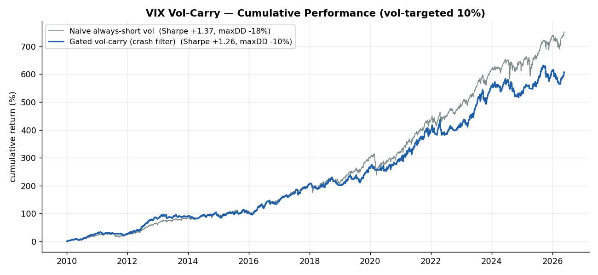
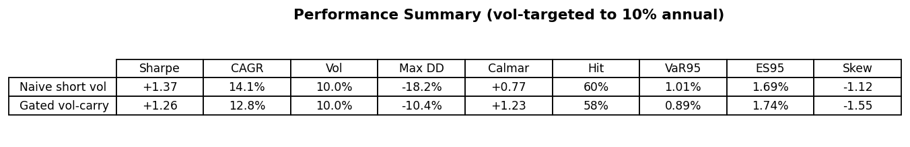
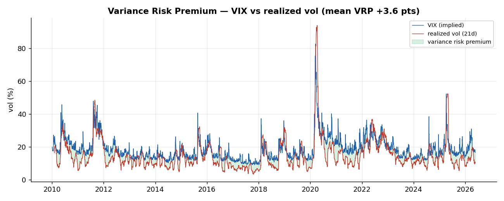
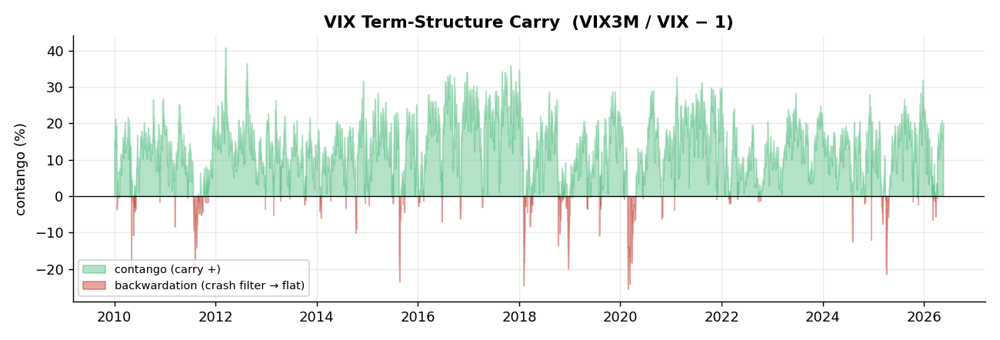
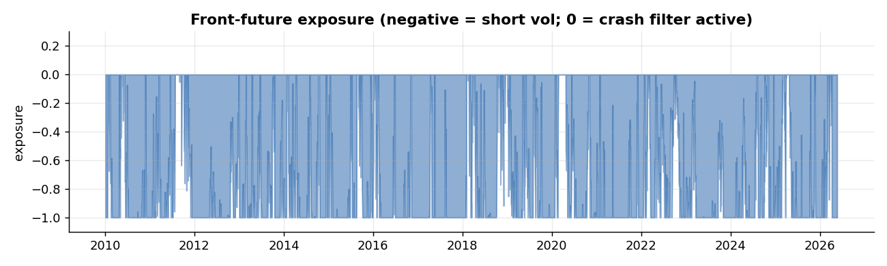
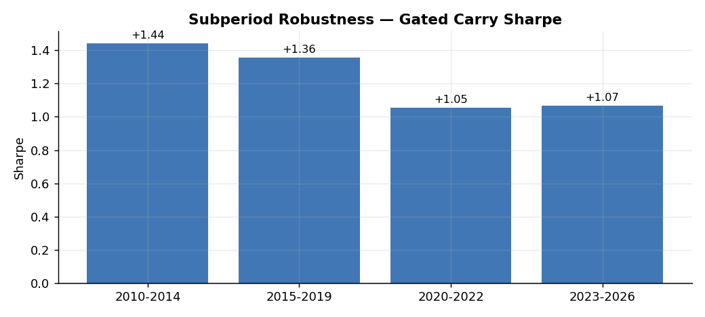
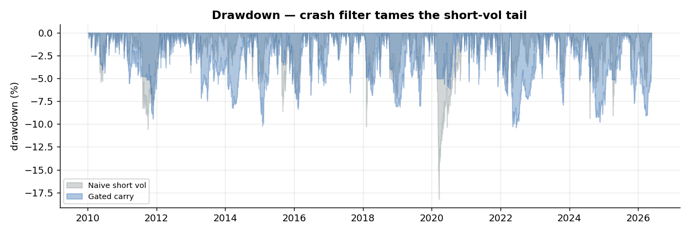
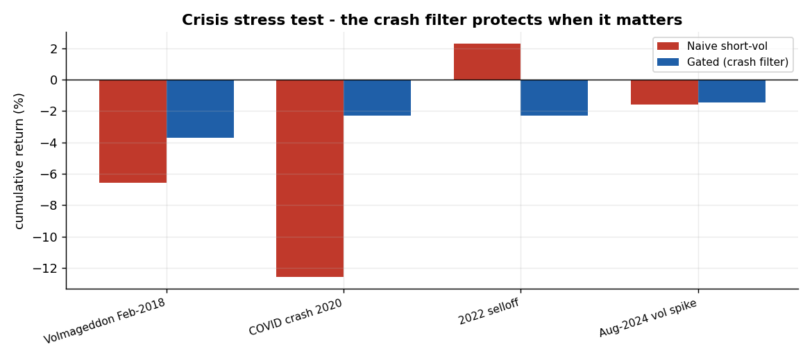
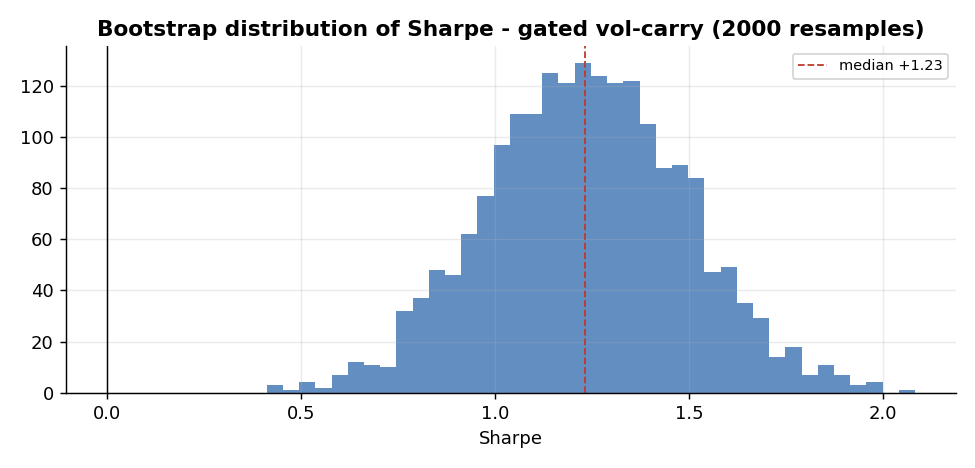

# VIX Volatility-Carry Engine

> Harvesting the **variance risk premium** through the VIX-futures term-structure roll, with a **term-structure crash filter** — built on LSEG data (2010–2026), roll-aware and look-ahead-free.



## Why this project matters

Two of the most robust facts in equity volatility:

1. **Variance risk premium (VRP)** — the VIX (implied vol) is, on average, *above* subsequently-realized volatility. Here the mean VRP is **+3.6 vol points**. Sellers of volatility are paid this premium.
2. **VIX-futures carry** — the curve is in **contango 92%** of the time (`VXc1 < VXc2`). A short front future "rolls down" toward spot → positive carry.

The catch: short-volatility has **catastrophic tail risk** (Feb-2018 "Volmageddon", Mar-2020). This engine adds a **crash filter**: when the curve inverts (`VIX > VIX3M`, backwardation), the regime has flipped — exposure is cut to flat. The result is a smoother ride with roughly half the drawdown.

## Key results (2010–2026, vol-targeted to 10% annual, after costs)

| Strategy | Sharpe | CAGR | Vol | Max DD | Calmar | Hit |
|----------|:------:|:----:|:---:|:------:|:------:|:---:|
| Naive always-short vol | +1.37 | +14.1% | 10.0% | −18.2% | +0.77 | 60% |
| **Gated vol-carry (crash filter)** | +1.26 | +12.8% | 10.0% | **−10.4%** | **+1.23** | 58% |



> **Honest read:** the crash filter does *not* maximize Sharpe — it gives up a little carry by sitting out inverted-curve regimes. What it buys is **tail protection**: the max drawdown is roughly halved and Calmar nearly doubles. Short-vol returns are negatively skewed by construction (you sell insurance) — managing the tail is the whole game, and that is exactly what the filter does.

## The premium and the carry




## Methodology

- **Roll-aware returns** — continuation futures (`VXc1`) jump when the contract rolls (≈ monthly). The splice is detected (an upward jump that lands near the previous 2nd-month level) and replaced with the held-contract's true move, so the carry is not swamped by the roll artifact. (~11.5 rolls/year detected, matching the VIX expiry cycle.)
- **Carry signal** — contango = `VIX3M / VIX − 1`. Short-vol exposure `= −min(contango / 10%, 1)`.
- **Crash filter** — exposure forced to flat when `VIX > VIX3M` (backwardation).
- **No look-ahead** — every signal is `shift(1)` before being applied; costs charged on exposure change.



## Risk controls

- Roll-aware, look-ahead-free returns; costs on turnover; vol-targeting for interpretable risk.
- Crash filter caps the short-vol tail (drawdown −18% → −10%).
- **Subperiod robustness** across four regime eras; automated `quant_checks` + a `pytest` suite (6 tests).




## Limitations

- Vol-normalized PnL scaled to a 10% target — not a sized dollar book; VIX-futures roll is **approximated** from continuation series (no exact expiry calendar).
- Short-vol is inherently tail-risky even after gating — position limits and sizing matter live.
- Research only — **not investment advice**.

## Robustness (`python scripts/run_robustness.py`)

**Crisis stress tests** — does the crash filter protect on the episodes that actually matter? (cumulative return, vol-targeted 10%)

| Episode | Naive short-vol | Gated (crash filter) |
|---------|:---------------:|:--------------------:|
| Volmageddon Feb-2018 | −6.6% | **−3.7%** |
| COVID crash 2020 | −12.6% | **−2.3%** |
| 2022 selloff | +2.3% | −2.3% |
| Aug-2024 vol spike | −1.6% | −1.5% |

The filter turns the Feb-2018 and Mar-2020 blow-ups into contained losses — the whole point of the design, shown on the right episodes. (Honest caveat: in the 2022 *grind* — not a vol spike — the filter sat out and gave up a small gain.)



**Bootstrap** — gated-carry Sharpe 90% CI **[+0.81, +1.65]**, median +1.23, P(Sharpe > 0) = **100%** (block bootstrap, 2000×, 21-day blocks).



## Repository structure

```
vix-vol-carry/
├── README.md · LICENSE · requirements.txt
├── data/raw_prices/      # .VIX, .VIX3M, .VIX9D, .VVIX, VXc1–VXc3, SPY (LSEG)
├── src/
│   ├── data.py           # load / fetch (LSEG)
│   ├── strategy.py       # roll-aware returns, carry + crash filter, quant_checks
│   ├── metrics.py        # vol targeting + performance/risk metrics
│   └── plots.py          # figures
├── scripts/
│   ├── run_backtest.py   # metrics + integrity checks
│   └── generate_report.py# figures + tearsheet
├── tests/test_strategy.py
├── docs/assets/          # figures
└── reports/strategy_tearsheet.md
```

## How to run

```bash
pip install -r requirements.txt
python scripts/run_backtest.py        # backtest + metrics + integrity checks
python scripts/generate_report.py     # figures + tearsheet
pytest -q                             # test suite
```

*Built with Python (pandas, numpy, matplotlib). Data: LSEG / Refinitiv. Part of a multi-strategy volatility & relative-value research portfolio.*
